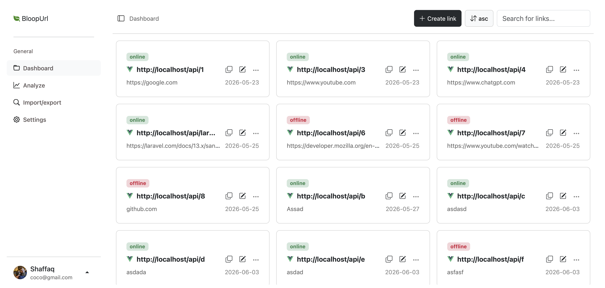
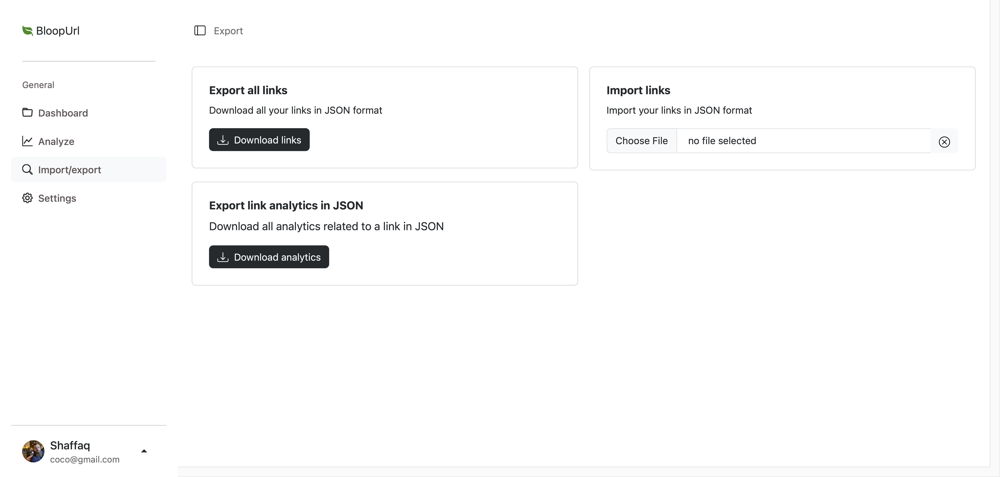
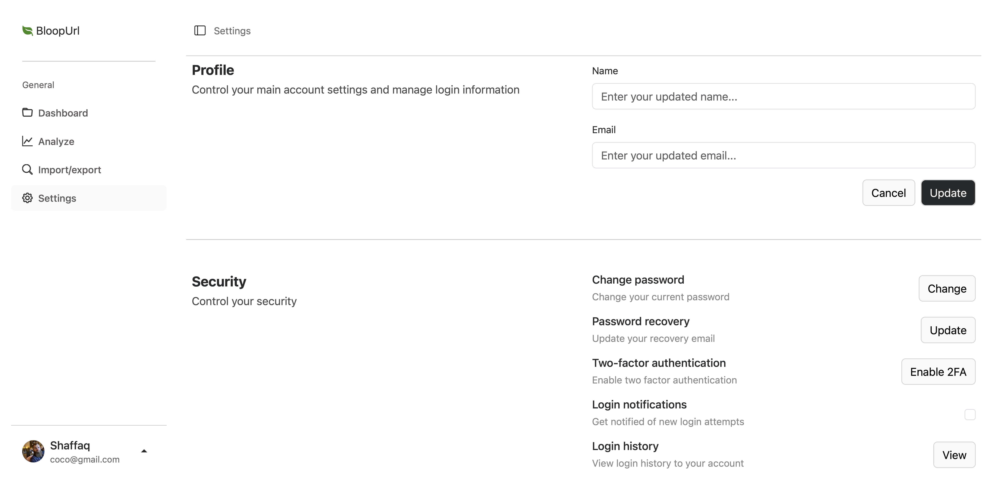

<!-- PROJECT LOGO -->
<br />
<div align="center">
<!--
  <a href="https://github.com/othneildrew/Best-README-Template">
    
  </a>
-->

  <h3 align="center">BloopUrl</h3>

  <p align="center">
    A simple URL shortener for all your needs!
    <br />
    <br />
    <a href="#">View project</a>
  </p>
</div>

<!-- ABOUT THE PROJECT -->
## About The Project

[![Product Name Screen Shot][create-screenshot]](#)

A URL shortener built to make link management simple and reliable. Create short, shareable links in seconds, set custom expiration dates, and track basic analytics to understand how your links are performing.

### Built With

[![Vue][Vue.js]][Vue-url] [![Laravel][Laravel.com]][Laravel-url] [![Bootstrap][Bootstrap.com]][Bootstrap-url]

<!-- GETTING STARTED -->
## Getting Started

### Installation

1. Clone the repo
   ```sh
   git clone https://github.com/Coco194/bloopurl-frontend.git
   ```   
2. Install npm packages 
   ```sh
   npm install
   ```
3. Run the project
   ```sh
   npm run serve
   ```
4. For production 
   ```sh
   npm run build
   ```

<!-- USAGE EXAMPLES -->
## Some screenshots

<!--



-->


Use this space to show useful examples of how a project can be used. Additional screenshots, code examples and demos work well in this space. You may also link to more resources.

_For more examples, please refer to the [Documentation](#)_

<!-- ROADMAP -->
## Roadmap

- [x] Add dashboard for managing URLs
- [x] Add login/register page with auth (backend auth done separately)
- [x] Add loading and success states
- [x] Analytics (clicks, visits, browsers) visualization with charts 
- [x] Add navigation guards
- [ ] Improve form validation and feedback
- [ ] Smooth UI animations
- [ ] QR code generation for URLs
- [ ] Multi-language Support
    - [ ] Chinese
    - [ ] Spanish

<p align="right">(<a href="#readme-top">back to top</a>)</p>


<!-- MARKDOWN LINKS & IMAGES -->
<!-- https://www.markdownguide.org/basic-syntax/#reference-style-links -->
[create-screenshot]: screenshots/create_link.png
[dashboard-screenshot]: screenshots/dashboard.png
[export-screenshot]: screenshots/export.png
[settings-screenshot]: screenshots/settings.png
[Vue.js]: https://img.shields.io/badge/Vue.js-35495E?style=for-the-badge&logo=vuedotjs&logoColor=4FC08D
[Vue-url]: https://vuejs.org/
[Laravel.com]: https://img.shields.io/badge/Laravel-FF2D20?style=for-the-badge&logo=laravel&logoColor=white
[Laravel-url]: https://laravel.com
[Bootstrap.com]: https://img.shields.io/badge/Bootstrap-563D7C?style=for-the-badge&logo=bootstrap&logoColor=white
[Bootstrap-url]: https://getbootstrap.com